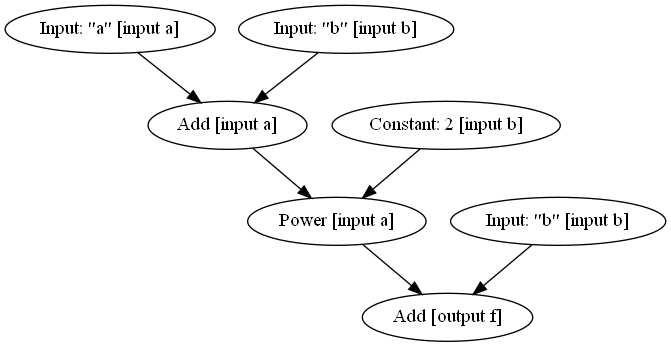
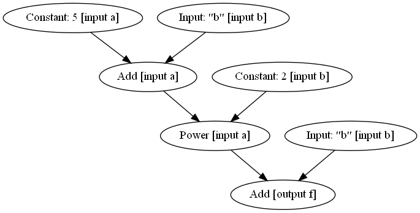
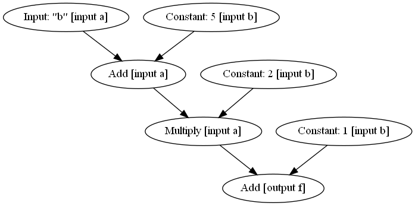

# Math graph

What can you do if you represent a mathematical function as a graph of its constituent operations as nodes?

Probably not an original idea, but I was inspired by graph representations of neural networks.

Still, the end result is pretty cool :D.

I also have no idea what to do with it but want to share it anyways.

Requires [Graphviz](https://graphviz.org/) and `pydot` (`pip install pydot`).

## Demo

Define a function:

```py
from mathgraph import compile_operation

@compile_operation
def f(a, b):
    return (a + b) ** 2 + b
```

Evaluate the function:

```py
>>> f(a=2, b=3)
Constant(28)
```

Visualise the function:

```py
>>> f.visualise().write_png('mathgraph_f.png')
```



Partially evaluate the function:

```py
>>> g = f(a=5)
>>> g(b=6)
Constant(127)
>>> g.visualise().write_png('mathgraph_g.png')
```



Differentiate the function:

```py
>>> dg_db = g.gradient('b').simplified()
>>> dg_db(b=6)
Constant(23)
>>> dg_db.visualise().write_png('mathgraph_dg_db.png')
```



## Needs work (but I have no time and am too lazy)

- [ ] Graph simplification (e.g., combining chained powers, etc.)
- [x] Non-constant exponents (e.g., `e^x`)
- [ ] Print mathematical formula as text
